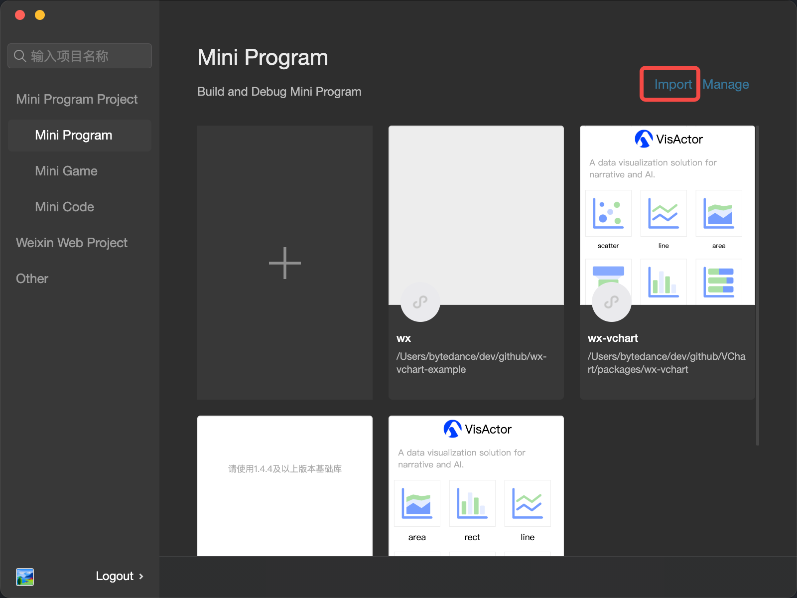
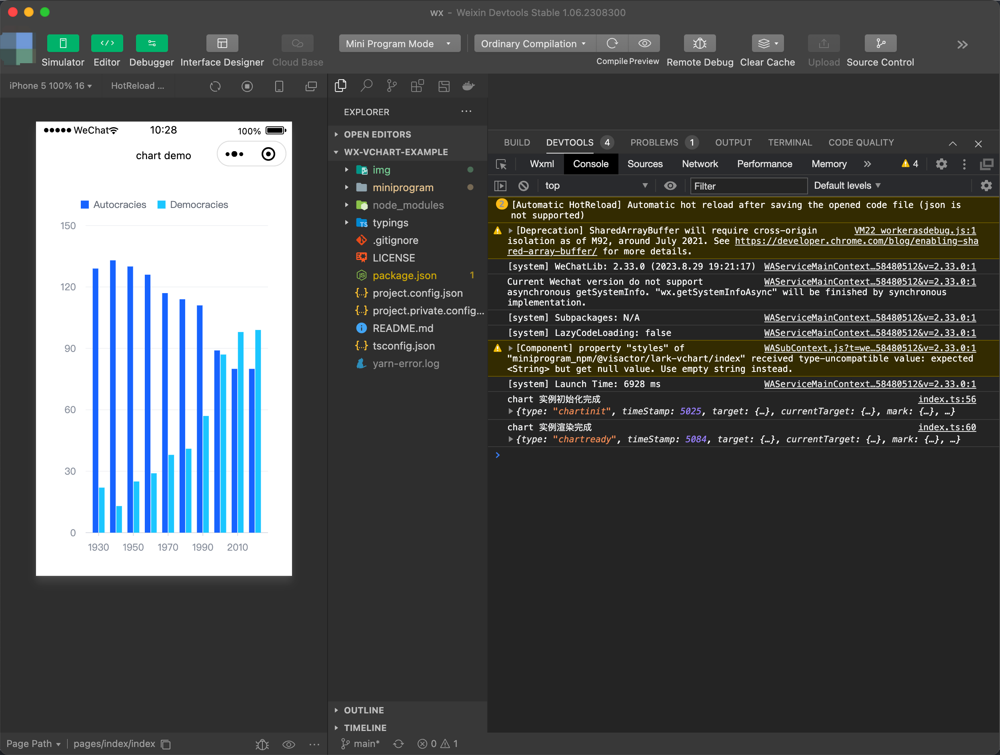

# 微信小程序使用 VChart 示例

## 如何使用

在使用 VChart 微信小程序组件库前，请确保你已经了解过微信开放平台的相关文档介绍。

- [自定义组件](https://developers.weixin.qq.com/miniprogram/dev/framework/custom-component/)

### Step 1: 下载微信开发者工具

[微信开发者工具](https://developers.weixin.qq.com/miniprogram/dev/devtools/devtools.html)

### Step 2：打开微信开发者工具，导入该项目

### Step 3: 体验

至此你就可以体验该示例了。

## 问题反馈

如果在使用过程中发现问题，欢迎在 [GitHub issues](https://github.com/VisActor/VChart/issues/new/choose) 中向我们反馈，非常感谢！